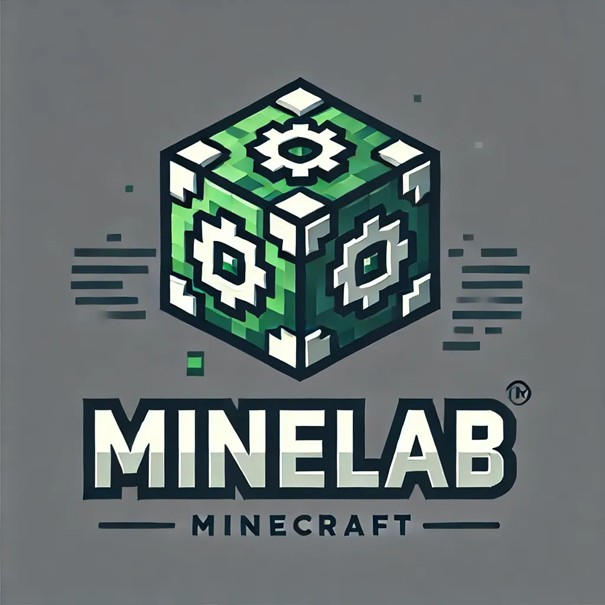

  

# MineLab
##   MineLab : Projet d'entreprise de création de mods et plugins Minecraft sur mesure

### Fonctionement : 

Plugin Minecraft

     
[GET] /verify?key=...
     
     
routes/licenses.py           👈 Reçoit l’appel
     
     
services/license_checker.py  👈 Fait les vérifications
     
     
models/license.py            👈 Accès BDD
     
     
schemas/license.py           👈 Structure la réponse
     
     
Plugin reçoit un JSON : { status: "valid", ... }
